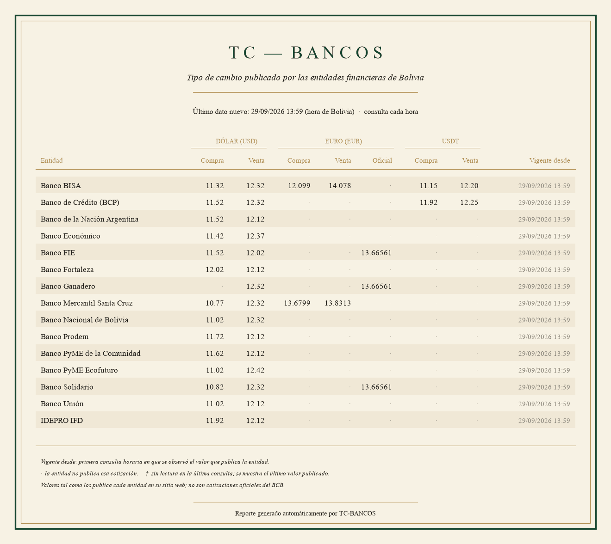

# TC-BANCOS

Cotizaciones del dólar, el euro y el USDT que publica cada entidad financiera de Bolivia en
su sitio web, consultadas cada hora.

## Datos

`ultimos_30_dias.csv` contiene la serie horaria de los últimos 30 días:

- una fila por consulta (`fecha_hora`, hora de Bolivia);
- un bloque de columnas por entidad: la primera fila del encabezado es la entidad y la
  segunda la cotización (`USD compra`, `USD venta`, `EUR compra`, `EUR venta`,
  `EUR oficial`, `USDT compra`, `USDT venta`);
- el bloque de una entidad solo tiene valores en la consulta en que publicó un dato nuevo;
  vacío significa que no hubo novedad.

Lectura en Python: `pd.read_csv("ultimos_30_dias.csv", header=[0, 1], index_col=0)`

Los valores se muestran tal como los publica cada entidad. No son cotizaciones oficiales
del Banco Central de Bolivia.
